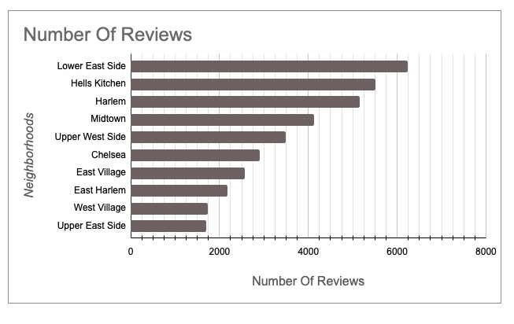

# Manhattan Airbnb Property Analysis

[LINK TO PROJECT](https://docs.google.com/spreadsheets/d/1HhwsPi5hr1pvMp4p94ci_fIJ3q6zTYCcYrR50fxo6oY/edit?usp=sharing)
---
[PDF](https://github.com/cullenmccutcheon/Data-Projects-TripleTen/blob/main/Manhattan%20Airbnb%20Property%20Analysis/Manhattan%20Airbnb%20Property%20Analysis.pdf)
---
## Executive Summary

This analysis provides actionable insights for investors in the Manhattan Airbnb market. By focusing on the most attractive neighborhoods and property sizes, and by quantifying revenue potential, this project offers a data-driven roadmap for maximizing returns in the vacation rental sector.

---
## Project Overview

You've been hired to help a client analyze the Manhattan vacation rental market and provide guidance on which property types to invest in. This project leverages NYC Airbnb data to answer key business questions about neighborhood and property size attractiveness, as well as revenue potential for vacation rentals.
1. **Which neighborhoods and property sizes (number of bedrooms) are most attractive for vacation rentals?**
2. **How much money did these listings generate?**
   
---

## Analysis 

**Data Cleaning:**  
- Cleaned neighborhood column for consistent capitalization and removed trailing spaces (`neighborhood_clean`).
- Cleaned bedrooms column, treating empty cells as studios (`bedrooms_clean`).
- Documented all cleaning steps in a separate change log sheet and preserved a copy of the raw data.

**Pivot Table Analysis:**  
- Identified the top 10 most attractive neighborhoods by total reviews.
- Determined the most popular property sizes (studios, 1-bedrooms, 2-bedrooms).
- Analyzed neighborhood-specific preferences for property size.

### Reviews Chart

  
**Revenue Analysis:**  
- Filtered for top listings (most popular size in each top neighborhood).
- Calculated revenue using the `calendar` sheet:  
  - Added `revenue_earned` column (only if property was rented).
  - Summed 30-day revenue and estimated annual revenue by multiplying by 12.
- Ranked top listings by revenue.

### Revenues Chart

---

## Results

The Lower East Side, Hell's Kitchen, and Harlem emerged as the most attractive neighborhoods for Airbnb rentals. Studios, 1-bedrooms, and 2-bedrooms were the most popular property sizes among guests. Neighborhood preferences varied, with 1-bedrooms being especially popular in Harlem. The top-earning listing generated $29,940 in 30 days, projecting to $359,280 annually.

## Conclusions

Manhattan’s Airbnb market shows clear trends in both neighborhood and property size preferences. Investors can maximize occupancy by focusing on the most in-demand areas and unit types. Revenue potential is significant, especially for well-located and appropriately sized properties. Data-driven strategies are essential for standing out in a competitive rental landscape.

## Recommendations

Invest in properties located in the Lower East Side, Hell's Kitchen, or Harlem to capture high demand. Prioritize studios and 1-bedroom units, especially in neighborhoods where they are most popular. Regularly review and adjust pricing based on neighborhood trends and seasonality. Maintain high listing quality and monitor guest reviews to sustain strong rental performance.

---

*This project demonstrates advanced skills in data cleaning, pivot table analysis, and business intelligence storytelling using real-world Airbnb data.*
