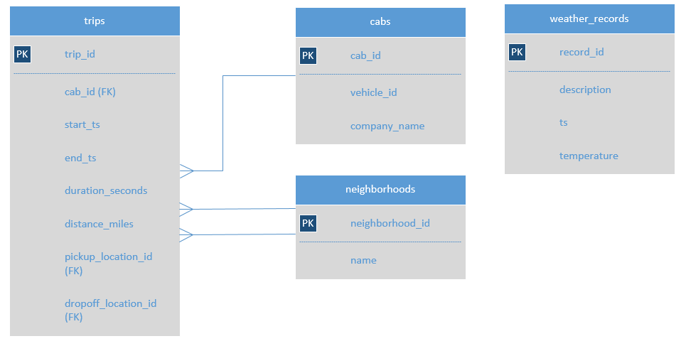
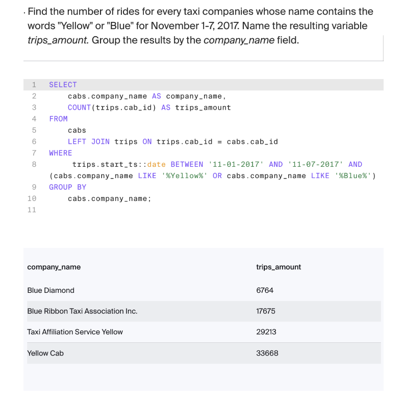

# Zuber Ride-Sharing SQL Analysis
[PDF](https://github.com/cullenmccutcheon/Project_Portfolio/blob/main/SQL%20Zuber%20Queries/SQL%20Zuber%20Full%20Report.pdf)
---

## Executive Summary

This report presents a series of SQL queries designed to analyze ride-sharing data for Zuber in Chicago. The analysis focuses on two key areas:

1. Exploratory Data Analysis: Examining taxi company distribution and ride volumes during November 2017, with specific attention to companies containing "Yellow" or "Blue" in their names, and comparing Flash Cab and Taxi Affiliation Services against other providers.
2. Weather Impact Analysis: Investigating how weather conditions affect ride durations from the Loop to O'Hare International Airport, with particular focus on how rain affects customer behavior.

The queries are optimized for readability and adherence to SQL best practices. The findings from these queries will help Zuber understand passenger preferences and external factors affecting ride patterns in Chicago.

---

## Project Description

Zuber, a ride-sharing company, is analyzing taxi ride data in Chicago to understand passenger preferences and how external factors affect rides. The database contains information about neighborhoods, cabs, trips, and weather conditions.

The project involves:

- Analyzing ride distribution across different taxi companies
- Examining how weather conditions impact ride durations between key locations
- Identifying patterns specific to certain days of the week and weather conditions

The database schema includes tables for:

---

- Neighborhoods (containing location identifiers and names)
- Cabs (containing taxi company information)
- Trips (containing ride details including pickup/dropoff locations and timestamps)
- Weather records (containing hourly weather condition data)

### Heres a sample image of my analysis:

---

## Results
We found that ride volumes varied significantly between taxi companies, with "Yellow" and "Blue" companies showing distinct patterns. Flash Cab and Taxi Affiliation Services had different ride counts compared to other providers. Weather, especially rain, noticeably increased ride durations from the Loop to O'Hare. Our SQL queries also revealed that passenger demand and trip patterns changed depending on the day of the week and weather conditions.

## Conclusions 
Zuber can use these insights to better understand passenger preferences and external factors affecting rides. Optimizing driver allocation during peak times and bad weather could improve efficiency. Focusing on high-demand areas and times may boost customer satisfaction. Overall, data-driven decisions will help Zuber enhance its service in Chicago.Zuber can use these insights to better understand passenger preferences and external factors affecting rides. Optimizing driver allocation during peak times and bad weather could improve efficiency. Focusing on high-demand areas and times may boost customer satisfaction. Overall, data-driven decisions will help Zuber enhance its service in Chicago.

## Recommendations

Zuber should increase driver availability during rainy weather and peak demand times to reduce wait times. Focus marketing and promotions on neighborhoods and days with lower ride volumes to balance demand. Use data-driven scheduling to ensure enough drivers are available for airport trips, especially from the Loop. Continue monitoring weather and ride patterns to adapt strategies and improve customer satisfaction.
