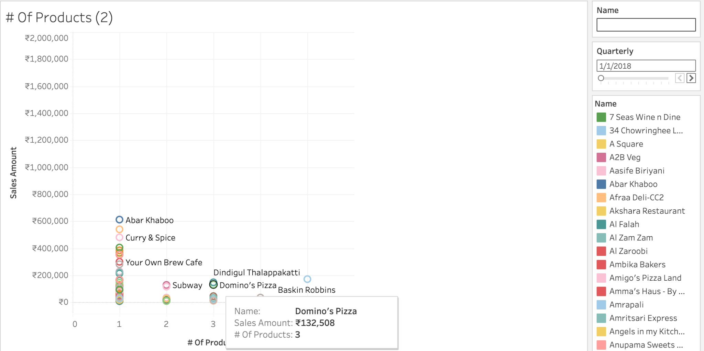

# Zomato Customer Segmentation and Sales Analysis

[Tableau Dashboard](https://public.tableau.com/shared/DYYB3JNFN?:display_count=n&:origin=viz_share_link)
---
[PDf](https://github.com/cullenmccutcheon/Project_Portfolio/blob/main/Tableau%20Zomato%20Customer%20Segmentation%20and%20Sales%20Analysis/Zomato%20Customer%20Segmentation%20and%20Sales%20Analysis%20FINAL.pdf)
---
## Executive Summary

Our analysis of Zomato's sales data reveals key opportunities to drive growth by increasing product offerings for brands (our customers), specifically Northern Indian Cuisine.

Paratha Plaza is part of the Northern Indian cuisine segment, which is our largest and most diverse. However, most brands in this segment currently have low-value purchasing patterns (limited product variety).

The data shows that Zomato saw strong and consistent sales growth with Domino's as Domino's began to purchase a wider variety of products. If more brands in the Northern Indian segment were offered and purchased an expanded product selection, Zomato could potentially see sales growth in that segment. Increasing the variety of options available to brands and encouraging diversity in their purchases could significantly improve sales in this segment.

McDonald's, while a major buyer, typically purchases only one product. Expanding the range of products available to McDonald's presents a clear opportunity to increase their sales.

## Project Description

Zomato aims to enhance business performance by leveraging data-driven insights from sales patterns across our restaurant partners and customer base. Our goal is to identify context using customer segmentation that can inform growth strategies , improve customer retention, and identify pain points through customer segmentation and sales analysis.

## Results

**1. McDonald's**  
Dominates beverage sales but focuses on just one product, missing out on potential growth from a broader selection, (refer to "Domino's Sales").
Most buyers in Beverages buy only one product and are in the low or medium-value segments, presenting an opportunity 
to not only improve sales to those customers but to significantly increase the Beverages segment as a whole because McDonalds
is the majority share in that market. Like Dominos, theres potential for linear growth in relation to product purchase variety.

**Paratha Plaza (Northern Indian Cuisine)**  
Most brands are low value, engaging only once or infrequently, lagging behind the loyalty seen in other segments.  
Attracting more customers each month, but people are spending less per order, indicating room to boost how much each customer buys.  
The most populous segment, presenting the greatest opportunity for growth through loyalty programs and expanded product offerings.

**Domino's Sales**  
Is driven by an increase in the variety of products purchased, resulting in a larger share of our total sales.  
Consistently achieves higher sales and revenue across their venues due to an increasing variety of products purchased.

## Conclusions

- Domino's leads in both sales and order volume, showing steady growth.  
- McDonald's is the top performer in the beverage segment, maintaining strong sales but with a limited product range.  
- The Northern Indian cuisine segment stands out for its size and diversity, achieving high overall sales despite lower average sales per venue/brand.
- Domino's growth is related to growth in the variety of products they purchase 
- McDonald's has most of its venues in the low and medium-value segments, indicating an opportunity to grow by expanding their product range.  
- The Northern Indian cuisine segment is mostly made up of brands with low-value purchasing patterns, highlighting significant untapped potential.
- Customers spending over 100,000 INR annually represent just 18% of our customer base but drive 45% of total sales.
- Expanding the variety of products available to brands leads to greater sales growth over time.
- Sales growth varies widely across both companies and cities, highlighting the importance of nurturing top customers.
- Consistent growth is fueled by a strong core of repeat brands and steady order volumes across their venues.
  

## Recommendations

Brands that purchase a broader variety of products from Zomato, like Domino's, consistently achieve higher sales growth.  
The Northern Indian cuisine segment presents the greatest opportunity: by broadening the inventory options available and running targeted campaigns to encourage Northern Indian brands to diversify their purchases, Zomato can unlock substantial sales growth.  
For McDonald's, expanding the range of products they buy could also drive significant gains.  
Across all segments, focusing on helping brands move into higher-value purchasing patterns will drive sustainable sales growth and reduce volatility.
- Encourage Northern Indian cuisine brands to expand their product variety, leveraging the proven growth trajectory seen with Domino's.
- Launch targeted marketing and retention programs for high-value, high-frequency brands to maximize their lifetime value.
- Support partners in developing loyalty programs and personalized offers to move more brands into higher-value purchasing segments.
- Advise restaurant partners to streamline menus and focus on top-performing items to boost sales efficiency.
- Monitor city-level trends to identify local growth opportunities and tailor promotional strategies accordingly.
- By focusing on expanding product variety and encouraging brands to diversify their purchases, Zomato and its partners can drive stronger sales and unlock new growth across the platform.
