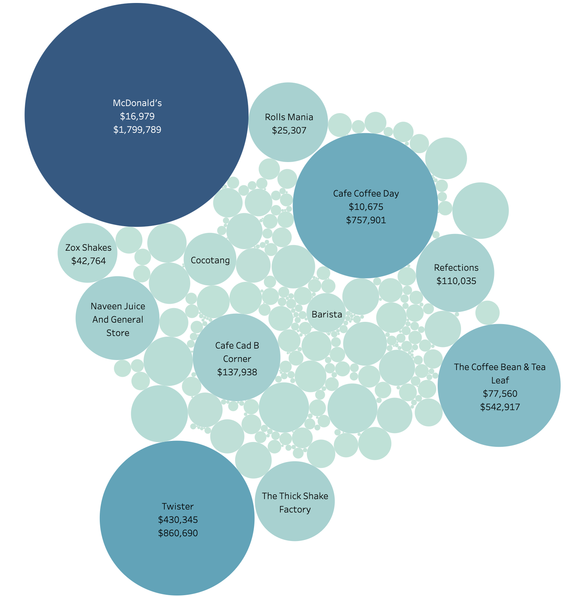

# Zomato Market Analysis Report

[PROJECT LINK](https://public.tableau.com/shared/YQW4ND5K7?:display_count=n&:origin=viz_share_link)
---
[PDF](https://github.com/cullenmccutcheon/Data-Projects-TripleTen/tree/main/Tableau%20Zomato%20Customer%20Segmentation%20and%20Sales%20Analysis)
---

## Project Description

### Business Problem

Zomato, a major food distributing company, aims to increase sales by leveraging customer segmentation methodology (RFM) to contextualize sales patterns across our restaurant partners and customer base. Our goal is to develop a narrative that can inform growth strategies, improve customer retention, and understand what is causing the decrease in company-wide sales.

## Executive Summary

Our analysis of Zomato's sales data reveals key opportunities to drive growth by increasing increasing inventory variety and optimizing campaigns to inform, encourage and reward brands and their individual venues.

Paratha Plaza is the most profitable brand of the Northern Indian cuisine segment, which is our largest and most diverse segment, as well as the most profitable. However, most brands in this segment currently have low-value purchasing patterns, presenting a significant opportunity for growth.

The data shows that Zomato saw strong and consistent sales growth with Domino's as Domino's began to purchase a wider variety of products. If more brands in the Northern Indian segment were offered an expanded product selection, Zomato could potentially see significantly improved sales growth in not just that segment, but the company as a whole.

McDonald's, while a major buyer, typically purchases only one beverage product. Expanding the range of products available to McDonald's presents a clear opportunity to increase sales in the beverages category.

Domino's is similar to McDonald's in the way it dominates its cuisine segment, and it has many venues. The difference lies in the linearity between its increasing sales trajectory, and increase in product variety.

## Results

Our analysis revealed several key insights:

1. **Cuisine Segment Performance**:
   - Northern Indian cuisine is the largest and most diverse segment, as well as the most profitable
   - Pizza and Beverages segments are dominated by 1-3 major brands with numerous venues
   - Most brands in the Northern Indian segment have low-value purchasing patterns

2. **Brand Performance**:
   - Domino's showed strong and consistent sales growth as it began to purchase a wider variety of products
   - McDonald's, while a major buyer, typically purchases only one beverage product
   - Paratha Plaza is the most profitable brand in the Northern Indian cuisine segment

3. **Customer Segmentation**:
   - High-value customers (RFM score ≥ 10) represent a small percentage of the user base but account for a disproportionately large share of revenue
   - Most users have a low recency score, indicating they have not made purchases recently
   - Frequency and Monetary scores show strong correlation; high-spending customers are typically frequent buyers

## Conclusions

The analysis points to several strategic opportunities:

1. Expanding product variety, particularly in the Northern Indian cuisine segment, could drive significant sales growth
2. The success with Domino's proves that product variety drives sales
3. McDonald's venues present an opportunity to expand beverage options
4. Venue-level monitoring can identify local growth opportunities
5. Targeting high-value venues with specialized programs can maximize their lifetime value

## Recommendations

1. Increase inventory variety, specifically in the Pizza, Beverages, and Northern Indian Cuisine segments, and run a marketing campaign for these new products
2. Offer Northern Indian brands expanded product variety, leveraging the proven growth trajectory seen with Domino's
3. In the Northern Indian segment, campaign focus should be broadly focused on all brands
4. Launch targeted retention programs for high-value, high-frequency brands like McDonald's and Pizza Hut by offering bulk sales discounts and novel product purchase discounts
5. Develop return buyer discount programs with personalized offers to shift mid-value brands into high-value segments
6. Monitor venue-level trends to identify local growth opportunities and tailor promotional strategies accordingly

Zomato can reverse sales declines by strategically engaging restaurant partners' venues to increase their purchasing value. Key opportunities:
- The Golden 18%: Customers spending over 100,000 INR annually represent just 18% of our customer base but drive 45% of total sales.
- Northern Indian Cuisine Potential: The Northern Indian cuisine segment presents the greatest opportunity: by broadening the inventory options available and running targeted campaigns to encourage Northern Indian brands to diversify their purchases, Zomato can unlock substantial sales growth through this segment alone!
  1. Expand product variety available to venues (regional specialties, complementary items).
  2. Create "starter packs" of recommended products for Northern Indian venues.
  3. Implement tiered loyalty programs to incentivize higher-value purchases from these venues.
  4. Offer bundled discounts on initial and novel product purchases.
- Replicate the Domino's Model: Zomatos success with Domino's proves product variety drives sales.
- Maximize McDonald's Beverage Dominance: McDonald's venues are only buying one beverage product! Expand their options with seasonal drinks, premium coffees, and healthier alternatives. Suggestion: Partner with McDonald's to develop exclusive Zomato beverage bundles.
- Focus on Venue-Level Trends: Monitor what's selling at the venue level and tailor promotions accordingly. Offer incentives to venues based on their local demand.
- Prioritize High-Value Venues: Launch a "Golden 18%" VIP program to reward top-spending venues with bulk discounts and exclusive offers.

By focusing on these strategies, we can transform low-value brands and their venues into high-value partners, driving sustainable revenue growth for Zomato. This dashboard will track progress and optimize our approach in real-time.
